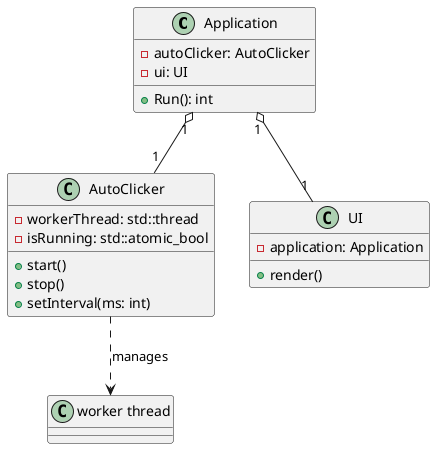
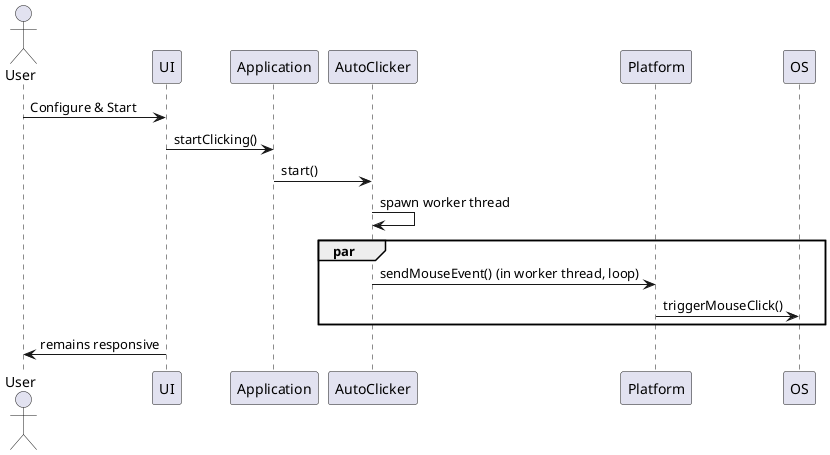

# AutoClicker

AutoClicker is a cross-platform, open-source application written in C++ that automates mouse clicking activities. Its primary use case is to simulate mouse clicks at configurable intervals, helping users automate repetitive tasks on their computer.

## Features

- Simulate mouse clicks automatically
- Configurable click interval and duration
- User-friendly UI (built with ImGui and SDL3)
- Cross-platform support (Windows, macOS, potentially Linux)
- Multi-threaded: UI and click logic run on separate threads
- Easy to build and extend

## Project Structure

```
.
├── CMakeLists.txt         # Build configuration file
├── extern/                # External libraries (e.g., SDL, ImGui)
├── src/
│   ├── main.cpp           # Application entry point
│   ├── core/              # Core application logic (Application, AutoClicker)
│   ├── ui/                # User interface logic (ImGui-based)
│   ├── platform/          # Platform-specific implementations
│   └── common/            # Common utilities and shared code
└── .vscode/               # Editor configuration (optional)
```

## Dependencies

- C++17 compiler
- [SDL3](https://github.com/libsdl-org/SDL)
- [Dear ImGui](https://github.com/ocornut/imgui)
- CMake >= 3.16

All required dependencies are included as submodules in the `extern/` directory.

## Building

1. Clone the repository:

    ```sh
    git clone --recurse-submodules https://github.com/nttnguyen136/autoclicker.git
    cd autoclicker
    ```

2. Create a build directory and run CMake:

    ```sh
    mkdir build
    cd build
    cmake ..
    cmake --build .
    ```

3. Run the application:
    - On Windows: `.\AutoClicker.exe`
    - On macOS/Linux: `./AutoClicker`

## Usage

- Launch the application.
- Use the graphical interface to configure click interval, duration, and other parameters.
- Start/stop the auto-clicking process as desired.

## Platform-Specific Notes

- On macOS: The application links against native frameworks (e.g., ApplicationServices, OpenGL, CoreFoundation).
- On Windows/Linux: SDL and ImGui are the main dependencies.

## System Architecture & Design

### High Level Design

The application is modular and multi-threaded:

- **UI (main thread):** Handles all user interactions and rendering, runs in the main thread.
- **Application:** Coordinates between UI and AutoClicker logic.
- **AutoClicker (worker thread):** Runs the automatic clicking logic in a separate thread.
- **Platform Layer:** Abstracts OS-specific mouse event handling.

```
+--------------------------+
|         UI (Main)        |           (User Interface, renders and handles input)
|--------------------------|
|   - UI class             |
+-----------+--------------+
            |
            v
+-----------+--------------+
|       Application        |           (Orchestrates UI and logic)
+-----------+--------------+
            |
            v
+--------------------------+      <--- Main thread spawns worker thread
|      AutoClicker         |           (Handles click automation)
|--------------------------|
|   - AutoClicker class    |<------ Worker Thread
+-----------+--------------+
            |
            v
+--------------------------+
|    Platform Abstraction  |           (OS-specific implementation)
|--------------------------|
|   - Platform class       |
+--------------------------+
            |
            v
+--------------------------+
|      OS Mouse Events     |
+--------------------------+
```

- The **UI** and **Application** run on the main thread.
- The **AutoClicker** logic runs in a separate worker thread, periodically invoking the **Platform** class to generate mouse events.
- The **Platform** class abstracts the differences between operating systems.

**Legend:**  

- Each box represents a class or group of classes/modules in the system.
- Arrows indicate the direction of interaction or invocation.
- The worker thread for `AutoClicker` is explicitly shown to highlight multi-threaded design.

### Class Diagram



### Sequence Diagram



**Note:**  

- You can render these diagrams using PlantUML (<https://plantuml.com/>) or draw.io, then save the images in a `docs/` folder and reference them in the README as follows:

```markdown


```

---

## Contributing

Contributions are welcome! Please open issues or pull requests as needed.

## License

This project is licensed under the MIT License.

---

**Author:** nttnguyen136
